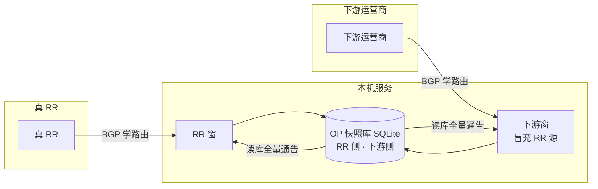

# BGP 双向中间人架构（最终版）

本文描述 **现网最终形态**：**bgp-agent** 按「LinuxA BGP Route Persistence Proxy」方案承载 **百万级 RIB**（GoBGP **RX/TX 分离** + **Redis 热缓存** + **RocksDB 持久化**）；**mtr-op** 在其上增加 **SQLite 运营快照**（邻居 meta、Web 分页、按 peer 通告编排、freeze 元数据），**并未用 SQLite 替代 Redis/RocksDB**。

| 层级 | 存储 | 规模与职责 |
|------|------|------------|
| **数据面 / 会话保活** | Agent：**Redis + RocksDB** + 内存 Effective RIB | 从 RR 学全量、RR down 后 TX 继续通告、进程重启从 RocksDB 恢复 |
| **控制面 / 运维** | OP：**SQLite**（meta/freeze）+ Agent RIB API | Web「学习路由」**分页读 Agent**；邻居 **入库/通告** 开关 |

网口与地址分工见 **[BGP_OP_NETWORK.md](./BGP_OP_NETWORK.md)**。表结构与 HTTP 接口见 **[BGP_DATA_AND_API.md](./BGP_DATA_AND_API.md)**。部署步骤见 **[BGP_RXTX_DEPLOYMENT.md](./BGP_RXTX_DEPLOYMENT.md)**。

---

## 1. 要解决的问题

传统单进程 BGP（含 FRR）常见行为：

```
RR 断链 → peer down → 全量 withdraw → 下游立刻丢路由
```

本系统目标：

| 场景 | 期望 |
|------|------|
| 上游 RR 断链 | **冻结** 已学路由；TX 继续向下游通告；**不**因 RR down 而撤销下游 |
| 下游运营商断链 | 冻结该 peer 在库内的 **下游窗** 快照；恢复后再覆盖 |
| 运维与交叉通告 | OP 读 **SQLite 快照** 编排通告（见 §6.4）；快照由 Agent **Effective RIB**（§2.1）定时拉取写入 |

---

## 2. 百万级 RIB：Redis / RocksDB（主存储，未改为 SQLite）

早期方案（**Persistent BGP Route Cache / LinuxA 代理**）的核心不变：**随机写百万 UPDATE 不能落 MySQL/SQLite**，必须用 **KV（RocksDB）+ 热读（Redis）**；**RR down ≠ withdraw**，靠 **RX/TX 分离 + Freeze**。

### 2.1 推荐架构（现网 bgp-agent，S 级）

```
                    ┌────────────┐
                    │     RR     │
                    └─────┬──────┘
                          │ iBGP · Full Table
                 ┌────────▼────────┐
                 │  GoBGP-RX       │  只收 UPDATE（WatchEvent）
                 └────────┬────────┘
                          │
                 ┌────────▼────────┐
                 │ Route Processor │  去重 · Effective RIB · Freeze
                 └────────┬────────┘
            ┌─────────────┴─────────────┐
      ┌─────▼──────┐            ┌──────▼──────┐
      │ Redis      │            │ RocksDB     │
      │ 热缓存      │            │ 持久化 RIB   │  ← 重启恢复、批量写
      └─────┬──────┘            └──────┬──────┘
            └─────────────┬───────────┘
                          │ Effective RIB
                 ┌────────▼────────┐
                 │  GoBGP-TX       │  只向 A/下游通告；RR down 仍读冻结 RIB
                 └────────┬────────┘
                          │ iBGP
                          ▼
                     下游 / 运营商 A
```

| 原方案要点 | 现网实现 | 代码/配置 |
|------------|----------|-----------|
| GoBGP RX 只收路由 | ✓ | `service/bgp_agent/pkg/rx/` |
| WatchEvent → Processor | ✓ | `rx_agent.watchRoutes` → `processor.HandleUpdate` |
| Redis 热缓存 `bgp:route:*` | ✓ | `pkg/storage/storage.go` |
| RocksDB 前缀 KV 持久化 | ✓ | 启动参数 `-rocksdb`（如 `/var/lib/bgp_agent/rocksdb`） |
| 批量写库（避免单条风暴） | ✓ | `processor.batchWriteLoop` |
| 不进 kernel FIB | ✓ | 控制面 only |
| GoBGP TX + Freeze | ✓ | `pkg/tx/`、`RunPeerWatch` |
| **SQLite 百万 RIB** | **✗ 未采用** | — |

启动示例（实验室 `200/lab.env`）：`REDIS_ADDR=localhost:6379`，`ROCKSDB_PATH=/var/lib/bgp_agent/rocksdb`。

### 2.2 那 SQLite 是什么？（OP 第二层，不是替换 RocksDB）

```
  RR / 下游 ──BGP──► bgp-agent (Redis + RocksDB)  ◄── 运行时真相 · 百万级
                           │
                   定时 HTTP 拉取（批量）
                   GET /api/routes
                   GET /api/tx/learned-routes
                           │
                           ▼
                    mtr-op SQLite
                    bgp_learned_routes   ◄── Web 分页 · neighbor_ip · 通告缓存编排
                    bgp_neighbor_meta
                    bgp_peer_snapshot
```

| 问题 | 答案 |
|------|------|
| 数据库怎么变成 SQLite 了？ | **只有 OP 运维库是 SQLite**；Agent 侧仍是 **Redis + RocksDB**，与早期方案一致。 |
| §3「持久化库」指谁？ | **产品语义**上的「两扇窗中间库」= SQLite 快照；**工程语义**上的「RIB 持久化」= **RocksDB**（+ Redis）。 |
| 学习路由页能扛百万行吗？ | **分页读 Agent** `GET /api/rib/routes`（OP 代理）；入库开关控制 Watch/ingest；**通告开关**触发 Agent `POST /api/rib/advertise` 流式任务（非分页 HTTP）。 |
| RR down 谁保证不断流？ | **Agent Freeze + TX 读 Effective RIB**（RocksDB 可恢复）；SQLite 在 peer frozen 时 **可不覆盖** 旧快照（§6.3）。 |

**现网缺口（需与 §2.1 对齐）**：会话上 `pfx_rcd` 已有路由，但 `GET /api/routes` 若为空，则 Processor→Redis 未写入，SQLite 同步也为空——应修 RX→Processor 全量/增量，而不是改用 SQLite 存百万 RIB。

---

## 3. 期望模型（两扇窗）

产品期望的抽象是 **左右两扇 BGP 窗**，中间 **OP 路由快照库** 分栏存放（SQLite，见 §2.2）；学路由 **先进入 Agent（Redis/RocksDB）**，再 **同步进快照库**；交叉通告 **读快照库** 全量推回对端（不直接在 Web 上扫 Agent 实时 RIB）。

```
                    真 RR                         本机服务                         下游运营商
                      │                              │                                │
                      │         ┌────────────────────┴────────────────────┐         │
                      │         │     OP 快照库（SQLite，源自 Agent）      │         │
                      └────────►│  RR 侧路由          │          下游侧路由   │◄────────┘
              BGP 学路由        │  route_window=     │  route_window=        │   BGP 学路由
           ┌──────────────      │  upstream          │  downstream           │      ──────────────┐
           │                    │  neighbor_ip=RR    │  neighbor_ip=对端     │                    │
      ┌────┴────┐               │                    │                       │               ┌────┴────┐
      │ RR 窗   │──────────────►│                    │◄──────────────────────│──────────────│ 下游窗  │
      │(如 207) │               └─────────┬──────────┴──────────┬────────────┘               │(冒充源) │
      └────▲────┘                         │                     │                            └────▲────┘
           │                              │                     │                                 │
           │         读库全量通告          │                     │         读库全量通告              │
           └──────────────────────────────┘                     └─────────────────────────────────┘
```

| 扇窗 | Agent | 写入库 | 每条路由如何标明来源 peer |
|------|-------|--------|---------------------------|
| **上游 / RR 窗** | RX 收真 RR | `bgp_learned_routes`，`route_window=upstream`，VRF 多为 `gobgp-rr` | 字段 **`neighbor_ip`** = RR 地址（如 `139.159.43.249` / 实验 `10.133.153.204`） |
| **下游窗** | TX ADJ-IN 收运营商 | 同表，`route_window=downstream`，VRF 为 `vbgp*` 等 | **`neighbor_ip`** = 该卫星 VRF 下的对端 IP |

**与界面的对应关系**

| 能力 | 数据源 | 说明 |
|------|--------|------|
| BGP 管理「收到 / 发送」 | Agent 会话计数（`pfx_rcd` / `pfx_adv`） | **实时**，用于会话是否正常 |
| 「学习路由」列表 | **只读 SQLite** | 定时双向同步后的快照；可按 `neighbor_ip`、`route_window` 筛选 |
| 「通告缓存」开关 | **本行 VRF + 对端 IP + 窗** 在库中的快照 | 开 = 把该 peer 对应窗的路由通告给对端；关 = 撤销 |

定时同步：`MTR_BGP_RIB_SYNC` / `MTR_BGP_RIB_SYNC_SEC`；上游源 `GET /api/routes`，下游源 `GET /api/tx/learned-routes?vrf=`（见 [BGP_DATA_AND_API.md](./BGP_DATA_AND_API.md) §4–5）。

**流量过滤（旁路）**：控制面 BGP 与转发面 **正交**。ICMP/MTR **逐跳源地址替换** 由 `hop_replace_rules` + `te_rewrite_nfqueue`（及 nft）完成，不经过 BGP 学路由路径（详见 §8）。



---

## 4. 逻辑角色与物理路径

```
                    ┌─────────────────┐
                    │  RR（真上游）    │
                    │ 139.159.43.249  │
                    └────────┬────────┘
                             │ 上游窗 · RX · 本端 207
                             │ enp59s0f0np0
                    ┌────────▼────────┐
                    │  OP + bgp-agent │
                    │ 207 / AS 63199  │
                    │ SQLite 快照      │
                    └────────┬────────┘
                             │ 下游窗 · TX · 冒充 249 等
                             │ eno1np0 + 卫星 VRF
                    ┌────────▼────────┐
                    │  运营商 / 对端   │
                    │ 139.159.43.208  │
                    └─────────────────┘

管理面：enp59s0f1np1 → 101.89.68.109:8808（不参与 BGP 数据面）
```

- **上游窗（upstream）**：与真 RR 的会话；本端 TCP 源 **207**；Agent **RX** 收全表；写入 SQLite `route_window=upstream`（VRF 多为 `gobgp-rr`）。
- **下游窗（downstream）**：卫星 VRF（`vbgp*`）内以 **冒充 IP**（如 249）为 TCP 源连运营商；Agent **TX** 收 ADJ-IN；写入 `route_window=downstream`。

---

## 5. 软件分层

```
┌──────────────────────────────────────────────────────────────┐
│  Web UI (static/index.html)                                   │
│  · BGP 管理：邻居 / 交叉通告 / freeze 状态                       │
│  · 学习路由：上游/下游分窗 · 只读 SQLite                         │
└────────────────────────────┬─────────────────────────────────┘
                             │ HTTP :8808
┌────────────────────────────▼─────────────────────────────────┐
│  mtr-op (service/app)                                         │
│  · main.py：REST API、后台 _bgp_rib_sync_loop                   │
│  · bgp_bidirectional_sync：定时双向写库                         │
│  · bgp_learned_routes_sync：上游 RR RIB → SQLite                │
│  · bgp_control：调用 bgp-agent                                  │
│  · storage.py：SQLite 表与 freeze / 通告来源解析                  │
└────────────────────────────┬─────────────────────────────────┘
                             │ HTTP :9179
┌────────────────────────────▼─────────────────────────────────┐
│  bgp-agent (service/bgp_agent)                                │
│  RX Agent      → WatchEvent → Route Processor → Redis/RocksDB │
│  TX Agent      → 按 VRF 向下游通告；peer down 时 VRF freeze     │
│  RunPeerWatch  → RR/下游 Established 变化 → Freeze/Unfreeze   │
└──────────────────────────────────────────────────────────────┘
```

**数据权威分工**

| 数据 | 运行时真相 | OP 展示 / 交叉通告 |
|------|------------|-------------------|
| 有效 RIB（上游） | Agent Processor + Redis/RocksDB | 定时同步 → `bgp_learned_routes` |
| 下游 ADJ-IN | TX 池内存 | 定时 `GET /api/tx/learned-routes` → SQLite |
| 邻居元数据、通告开关 | SQLite `bgp_neighbor_meta` | BGP 管理页 |
| Freeze 位（库侧） | SQLite `bgp_peer_snapshot` | 学习路由页、同步时跳过覆盖 |

**分层勿混**：百万级 **写路径** 在 Agent（Redis/RocksDB，§2.1）；OP SQLite 是 **读模型/运维快照**（§2.2）。Web 与「通告缓存」读 SQLite；**RR 断链保活** 依赖 Agent Freeze + RocksDB，不依赖 SQLite。

---

## 6. 双向：学 / 存 / 冻 / 搬

### 6.1 学（Learn）

| 方向 | Agent 来源 | OP 同步模块 |
|------|------------|-------------|
| 上游 | `GET /api/routes`（RX 有效 RIB） | `bgp_learned_routes_sync.sync_bgp_learned_routes` |
| 下游 | `GET /api/tx/learned-routes?vrf=` | `bgp_bidirectional_sync.sync_downstream_routes_for_vrf` |

后台任务：`main._bgp_rib_sync_loop` → `sync_bidirectional_routes`（周期 **`MTR_BGP_RIB_SYNC_SEC`**，默认 60；**`MTR_BGP_RIB_SYNC=0`** 可关）。

### 6.2 存（Store）

- 按 **peer** 覆盖写入 `bgp_learned_routes`（`replace_bgp_learned_routes_for_peer`）。
- 更新 `bgp_peer_snapshot`（条数、`last_sync_at`、`window_type`）。
- 全局同步结果写入 `bgp_rib_sync_state`。
- 上游前缀可选写入 `bgp_upstream_route_cache`（断链后合并展示 stale，见 `merge_upstream_stale`）。

### 6.3 冻（Freeze）

两层配合：

1. **Agent**（`RunPeerWatch`，默认 15s，`MTR_BGP_PEER_WATCH_SEC`）  
   - RR 非 Established → Processor 停收更新 + `txPool.FreezeAll()`  
   - 某下游 VRF peer 非 Established → 该 VRF TX freeze，继续通告已有路由  

2. **OP SQLite**（`bgp_peer_snapshot.frozen=1`）  
   - 定时同步 **不覆盖** 该 peer 的 `bgp_learned_routes`  
   - 学习路由 API 返回 `peer_frozen=true`  

RR 删除时 Agent 侧 `FreezeAll`；OP 删邻居会清该 IP 相关学习行。

### 6.4 搬（Cross-advertise / 通告缓存）

实现 **§3 图中「读库全量通告」**：以 Agent **按 peer 的 Redis/RocksDB**（`rib:{window}:{vrf}:{neighbor}:*`）为源；OP **通告开关** 触发 Agent **`POST /api/rib/advertise`**，进程内 **`IteratePeerRoutes` 流式扫描** + 批量 AddPath/Withdraw，**不**经 `GET /api/rib/routes` 分页。

| 本行邻居 | 读库范围 | 通告通道 |
|----------|----------|----------|
| RR / upstream | 来源 peer 的 **upstream** 窗 RIB | Agent job → RX `AddPath` |
| downstream | 默认上游 RR 入库来源 → 本行 TX VRF | Agent job → TX `AddPath` |

Web **BGP 管理 → 通告缓存** 仅开关（`advertise_routes` 0/1）。代码：`main._async_apply_bgp_peer_cache_advertise` → `bgp_peer_rib.start_rib_advertise_job`；进度 `GET /api/rib/advertise/status`（OP 代理 `GET .../advertise/status`）。

**遗留**：`storage.iter_bgp_routes_for_peer_window` / SQLite 快照路径仅供脚本兼容，非 Web 主路径。

**遗留 API**：`advertise_routes_from` 与 `iter_bgp_routes_for_advertise_source`（`@upstream` / `@downstream` / 指定邻居 IP）仍可用于脚本；与 §3 两扇窗模型一致，但 UI 已改为 **按 peer 读本窗缓存**。

---

## 7. RX/TX 分离（Agent 内）

```
     RR ──iBGP──► RX Agent ──Watch──► Processor ──► Redis / RocksDB
                                              │
                                              ▼
                                        Effective RIB
                                              │
     下游 ◄──iBGP── TX Agent ◄────────────────┘
```

**为何分离**：同一进程里 peer down 往往伴随 withdraw；RX 只收、TX 只发，才能在 RR down 时 **freeze 当前 RIB** 且 TX **继续通告**。

关键代码：

| 模块 | 路径 |
|------|------|
| RX | `service/bgp_agent/pkg/rx/` |
| TX | `service/bgp_agent/pkg/tx/` |
| Processor / Freeze | `service/bgp_agent/pkg/processor/` |
| Peer Watch | `service/bgp_agent/api_bidirectional.go` |
| HTTP | `service/bgp_agent/api_server.go` |

---

## 8. 与 MTR / 逐跳替换的关系

BGP 中间人负责 **控制面**（§2 Agent 存 RIB + §3 两扇窗快照/通告）；转发面 **ICMP-MTR 逐跳替换**（旁路能力）由 `hop_replace_rules` + `te_rewrite_nfqueue`（及 nft）完成，二者正交。部署时注意 `MTR_TE_REWRITE_SCRIPT` 指向实际脚本路径（见 [部署.md](./部署.md)）。

---

## 9. 现网参数速查

| 项 | 值 |
|----|-----|
| 管理 IP | `101.89.68.109`（`enp59s0f1np1`） |
| Web | `http://101.89.68.109:8808/` |
| bgp-agent API | `http://127.0.0.1:9179` |
| `LOCAL_AS` | `63199` |
| RR | `139.159.43.249` |
| RX 本端 / Router ID | `139.159.43.207`（`enp59s0f0np0`） |
| 下游示例 | `139.159.43.208`（卫星 VRF，`eno1np0`） |

---

## 10. 关联文档

| 文档 | 内容 |
|------|------|
| [BGP_DATA_AND_API.md](./BGP_DATA_AND_API.md) | SQLite 表字段、OP / Agent HTTP 接口 |
| [BGP_OP_NETWORK.md](./BGP_OP_NETWORK.md) | 三网口分工与环境变量 |
| [BGP_SATELLITE_IP_RULE_AND_DNAT.md](./BGP_SATELLITE_IP_RULE_AND_DNAT.md) | 卫星 `ip rule`、入站 :179 → TX 口 nft DNAT |
| [BGP_RXTX_DEPLOYMENT.md](./BGP_RXTX_DEPLOYMENT.md) | 编译、systemd、验收 |
| [BGP_ARP_SPOOF_MULTI_SESSION.md](./BGP_ARP_SPOOF_MULTI_SESSION.md) | ARP + 多 VRF 冒充（内核侧） |
| [部署.md](./部署.md) | 日常发版 |

实验室 `10.133.152.*` 拓扑见 [bgp-ipvlan-setup.md](./bgp-ipvlan-setup.md)，**勿直接套用到现网**。
