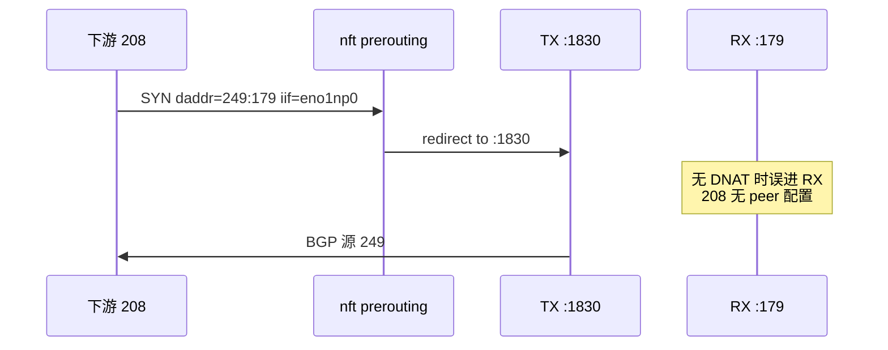

# 卫星 VRF：`ip rule` 与 nft DNAT（冒充 IP 连下游）

> **现网**：`101.89.68.109`、`冒充 139.159.43.249`、`vbgp13915943249`、`下游 139.159.43.208`、`eno1np0` / `enp59s0f0np0` 分工见 [BGP_OP_NETWORK.md](./BGP_OP_NETWORK.md)。  
> **实现**：`service/app/bgp_ipvlan_reconcile.py`；**补跑**：`109/reconcile_satellite.py` 或 `POST /api/arp-spoof/satellite-vrfs/reconcile`。

---

## 1. 为什么需要两套机制？

109 上同时存在 **RX（真 RR）** 与 **多实例 TX（卫星 VRF）**：

| 实例 | 监听端口 | 用途 |
|------|----------|------|
| **RX**（`gobgp-rr`） | **`0.0.0.0:179`** | 207 → 真 RR **249**（上联 `enp59s0f0np0`） |
| **TX**（每个 `vbgp*` 一个） | **`1791`～`1839` 等**（非 179） | 冒充源 → 下游（下联 `eno1np0` / `iv*`） |

TX 端口由 VRF 名哈希（与 `bgp_agent/pkg/tx/pool.go` 的 `portFor` 一致）：

```text
port = 1790 + 1 + (hash(vrf) % 50)
```

示例：`vbgp13915943249` → **1830**。

对端若按惯例配置 `neighbor 139.159.43.249`（标准 **TCP 目的端口 179**），报文会先进入内核 **179**。若不处理，会命中 **RX**，而 RX 未配置「208 是下游」，日志典型为：

```text
Can't find configuration for a new passive connection  Key=139.159.43.208
```

因此需要：

- **nft DNAT**：下联口入站 **`冒充IP:179`** → 重定向到该 VRF 的 **TX 监听口**
- **ip rule**：本机以 **冒充 IP 为源** 选路时进入 **卫星路由表**，避免走上联 `enp59` 或主表错口

---

## 2. 两种建连方向

### 2.1 109 主动连对端（109 → 208:179）

```text
109: 249(随机源端口) ──SYN──> 208:179
```

- bgp-agent：`local_address=249`，`bind_interface=iv249`，通常 **`passive_mode=false`**
- 出站主要靠 **VRF 内路由** + **`ip rule from 249`**
- **不经过**「目的为 249:179」的 nft DNAT（DNAT 只作用于 **入站 prerouting**）

仍建议保留 **ip rule + nft**：对端常会 **反连 249:179** 或双向尝试标准端口。

### 2.2 对端主动连 109（208 → 249:179）— **必须 DNAT**

```text
208:随机端口 ──SYN──> 109:249:179  （iif = eno1np0）
```

处理链：

1. **nft prerouting**：`daddr 249 dport 179` → **redirect 到 :1830**
2. **TX 实例**在 1830 上 accept，peer=208
3. 109 回包源地址 249：**ip rule** → 卫星表 → **iv249 / eno1np0**



---

## 3. nft DNAT（`inet mtr_bgp_sat_dnat`）

### 3.1 规则形态

收敛后典型一条（249 现网）：

```nft
table inet mtr_bgp_sat_dnat {
  chain prerouting {
    type nat hook prerouting priority -100; policy accept;
    iifname "eno1np0" ip daddr 139.159.43.249 tcp dport 179 redirect to :1830
  }
}
```

| 匹配项 | 含义 |
|--------|------|
| `iifname eno1np0` | 仅 **下游父口** 入站；**不**改上联 `enp59` 上真 RR 的 249:179 |
| `daddr` + `dport 179` | 对端按标准 BGP 访问 **冒充 IP** |
| `redirect :1830` | 改 **本机目的端口** 到 TX（非 SNAT，源 IP 仍为对端） |

### 3.2 何时跳过 DNAT

`should_satellite_dnat_spoof_ip()`：若冒充 IP **等于** `RR_ADDR`（真 RR 地址），且 ARP 父口 **就是** `MTR_BGP_RR_UPLINK_IFACE`，则 **不** 做 DNAT，避免破坏 **207→249** RX 会话。

现网 ARP 出接口为 **`eno1np0`**、上联为 **`enp59s0f0np0`** 时，**249 在下联仍安装 DNAT**；真 RR 与冒充下游 **二层分离**。

### 3.3 维护方式

| 方式 | 说明 |
|------|------|
| 环境变量 | `MTR_BGP_SAT_DNAT_AUTO=1`（默认开，依赖 `MTR_BGP_IPVLAN_AUTO=1`） |
| 保存 ARP / 卫星 reconcile | `POST /api/arp-spoof/satellite-vrfs/reconcile`（含全量 DNAT 重建） |
| 单 IP | `reconcile_satellite_dnat_for_spoof()` |
| 109 脚本 | `python 109/reconcile_satellite.py --vrf … --spoof …` |

可选：`MTR_BGP_SAT_DNAT_IIF=1` 强制带 `iifname`（默认在有条目 `egress_iface` 时已带）。

### 3.4 检查

```bash
nft list chain inet mtr_bgp_sat_dnat prerouting | grep 139.159.43.249
ss -tlnp | grep ':1830'    # 应为 bgp_agent
```

---

## 4. ip rule（源冒充 IP → 卫星表）

### 4.1 作用

Linux 上冒充 IP（如 249）挂在 **VRF / iv249** 上；若无 **policy rule**，`ip route get … from 249` 可能仍走 **主表 / enp59**，导致：

- 109 以 249 为源访问 208 时出错口
- BGP 回包不对称、**Active** 不 **Established**、对端看到 **RST**

**不会**为 **207**（`ROUTER_ID`）写 `from 207 lookup 卫星表`（见 `_should_policy_route_spoof`）。

### 4.2 现网示例（249 / 表 30449）

| pref | 规则 | 算法 |
|------|------|------|
| **1057** | `from 139.159.43.249 lookup 30449` | `1000 + (末字节 % 64)` |
| **41** | `from 139.159.43.249 to 139.159.43.208 lookup 30449` | `32 + (末字节 % 12)` |

表 **30449** 与 VRF `vbgp13915943249` 绑定，典型路由：

```text
139.159.43.208/32 dev iv249 scope link src 139.159.43.249
139.159.43.0/24   dev iv249 scope link src 139.159.43.249
local 139.159.43.249 dev iv249
```

### 4.3 与 DNAT 分工

| 场景 | 主要机制 |
|------|----------|
| 下游 → 冒充IP:**179** 入站 | **nft DNAT** → TX 口 |
| 109 以冒充IP 为源 → 下游 | **VRF 路由** + **ip rule** |
| `ip vrf exec vbgp…` | 直接用 VRF 表，与 rule 一致 |

### 4.4 检查

```bash
ip -4 rule show | grep 139.159.43.249
ip route show table 30449
ip route get 139.159.43.208 from 139.159.43.249
# 期望：dev iv249 … table 30449
```

---

## 5. 与真 RR（249）的隔离

| 流量 | 二层口 | 目的 | 处理 |
|------|--------|------|------|
| 207 → 真 RR 249 | enp59 | 249:179 | **RX :179**，**无** 下联 DNAT |
| 208 → 冒充 249 | eno1np0 | 249:179 | **nft → TX :1830** |
| 源 207 | — | — | **无** `from 207 lookup 30449` |
| 源 249（卫星） | eno1np0 | — | **ip rule → 30449** |

上联 RR 另由 `ensure_rr_uplink_policy_rules()` 维护 **`from 207 lookup 2103`** 等（与卫星表分开）。

---

## 6. BGP `passive_mode` 与 DNAT

在 OP 新增 **下游** 且 `source_ip` 为 **冒充 RR 地址**（`is_rr_spoof_ip`）时，若 `MTR_BGP_RR_SPOOF_PASSIVE=1`（默认），Agent 设 **`passive_mode=true`**：**109 不主动 SYN**，等对端连 **249:179** → 此时 **nft DNAT 几乎是必选项**。

若采用 **109 主动**连 **208:179**（`passive_mode=false`，`109/reconcile_satellite.py` 回收邻居时默认）：

- 仍应保留 **ip rule + nft**（对端常反连 179）

---

## 7. 环境变量补充

```bash
MTR_BGP_IPVLAN_AUTO=1          # ipvlan + VRF + ip rule
MTR_BGP_SAT_DNAT_AUTO=1        # nft mtr_bgp_sat_dnat（默认 1）
MTR_BGP_IPVLAN_BASE_IFACE=eno1np0
MTR_BGP_RR_UPLINK_IFACE=enp59s0f0np0
MTR_BGP_RR_SPOOF_IPVLAN_ADDR=1   # 上下联隔离：249/32 在 iv249，非主表上联
MTR_BGP_RR_SPOOF_PASSIVE=1       # 冒充 RR 下游默认被动等对端连 179
MTR_SATELLITE_BGP_TCP_SOURCE=spoof
```

---

## 8. 操作 checklist（每新增一个冒充 IP）

1. **ARP**：冒充 IP、`satellite_vrf`（或自动生成 `vbgp{去点IP}`）、出接口 **`eno1np0`**、启用  
2. **收敛**：`python 109/reconcile_satellite.py` 或 `POST /api/arp-spoof/satellite-vrfs/reconcile`  
3. **确认 nft**：`daddr <冒充IP> tcp dport 179 redirect :<TX端口>`  
4. **确认 ip rule**：`from <冒充IP> lookup <表号>`  
5. **BGP 管理**：卫星 VRF + 下游 + TCP 源 = 冒充 IP  
6. **对端**：`neighbor <冒充IP>`（179）或接受 109 主动连  

TX 端口勿手写 179；以 `tx_listen_port_for_vrf(vrf)` / nft 为准。

---

## 9. 故障对照（109 侧）

| 现象 | 优先查 |
|------|--------|
| `Can't find configuration for passive connection`（对端 IP） | **缺 nft** 或 DNAT 未限定 `iif eno1np0` 误伤上联 |
| `from 249` 走 **enp59** / 主表 | **缺 ip rule** → 补跑 reconcile |
| 长期 **Active**，对端 SYN **249:179** | **nft**、**:1830` 监听**、passive 与对端角色 |
| 真 RR 掉、冒充仍通 | 是否在上联对 249 做了 DNAT（应仅 **eno1np0**） |

---

## 10. 关联文档

- [BGP_OP_NETWORK.md](./BGP_OP_NETWORK.md) — 网口分工与操作顺序  
- [BGP_ARP_SPOOF_MULTI_SESSION.md](./BGP_ARP_SPOOF_MULTI_SESSION.md) — 多会话与 ARP  
- [BGP_RXTX_DEPLOYMENT.md](./BGP_RXTX_DEPLOYMENT.md) — 部署验收  
- [bgp-ipvlan-setup.md](./bgp-ipvlan-setup.md) — 实验室 `10.133.152.*` 历史  
- `109/README.md` — `reconcile_satellite.py` 用法  
