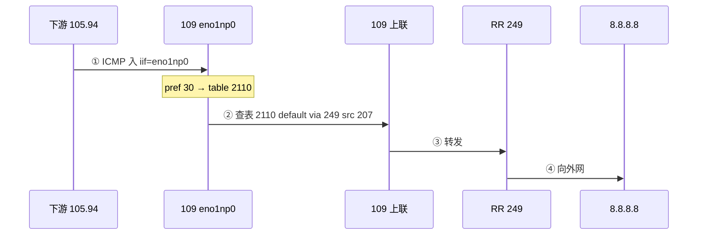
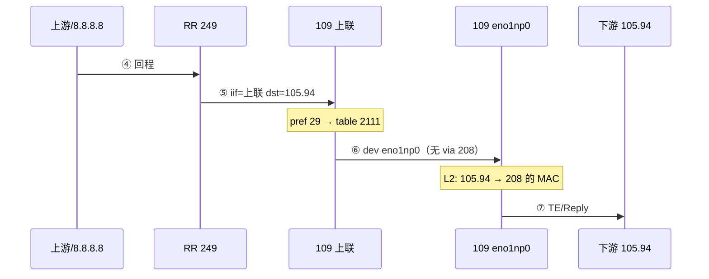

# 现网 109：下游 MTR 去程 / 回程（208 / 105.94）

本文档描述 **101.89.68.109** 上，客户端在下游机（对端 **139.159.43.208**，源 **139.159.105.94**）发起 **mtr → 8.8.8.8** 时，转发面的**去程**与**回程**路径、策略路由、二层邻居及 TE 改写关系。

- 网口分工见 [BGP_OP_NETWORK.md](./BGP_OP_NETWORK.md)
- 下发脚本：`109/apply_downstream_transit.py`（环境变量见 `109/env.example`）
- **不**走管理口 `enp59s0f1np1` 的 default；**不**进入卫星 VRF `vbgp13915943249`（该 VRF 用于冒充 **249** 连 208 的 BGP）

---

## 角色与地址

| 角色 | 地址 | 接口 / 说明 |
|------|------|-------------|
| OP 109 上联 | `139.159.43.207/24` | `enp59s0f0np0`，对 RR `249` |
| OP 109 下联 | `139.159.43.209/24` | `eno1np0` |
| OP 109 管理 | `101.89.68.109` | `enp59s0f1np1`，仅 SSH/Web |
| RR | `139.159.43.249` | 去程 default 下一跳 |
| 下游 peer | `139.159.43.208/24` | BGP 邻居；与 109 同二层 |
| 客户端 mtr 源 | `139.159.105.94` | 通常与 **208 同机双 IP** |
| 回程策略匹配前缀 | `139.159.105.92/30` | `MTR_DOWNSTREAM_RETURN_PREFIX` |

---

## 逻辑拓扑

```
                    ┌─────────────────┐
                    │  RR 43.249      │
                    └────────┬────────┘
                             │ 去程③ / 回程⑤
                    ┌────────▼────────┐
                    │  109 OP         │
                    │  207 上联       │
                    │  209 下联       │
                    └────────┬────────┘
                             │ ①出 / ⑦回
                    ┌────────▼────────┐
                    │  下游机 (208)   │
                    │  43.208 +       │
                    │  105.94 (mtr源) │
                    └─────────────────┘
```

---

## 去程：下联进 → 上联出

客户端从下游发出探测：**src=105.94，dst=8.8.8.8**（或逐跳递增），从 **109 的 eno1np0** 进入。



### 路由与规则（109）

| 项 | 值 |
|----|-----|
| **ip rule** pref **30** | `iif eno1np0 lookup 2110` |
| **table 2110** | `43.208/32 dev eno1np0` |
| | `43.0/24 dev eno1np0` |
| | `default via 249 dev enp59s0f0np0 src 207` |
| **主表** | `43.208/32 dev eno1np0`（辅助） |

### 验证命令

```bash
ip route get 8.8.8.8 from 139.159.105.94 iif eno1np0
# 期望：via 249 dev 上联，table 2110
```

### ICMP TE 改写（去程相关）

- 环境变量：`MTR_TE_REWRITE_IIF=enp59s0f0np0`，`MTR_TE_REWRITE_OIF=eno1np0`
- **FORWARD**：转发的 TE（上联→下联回程等）进 **NFQUEUE**（`te_rewrite_nfqueue`）
- **OUTPUT**（默认开）：**本机生成**的 TE（如 105.94→公网 第 1 跳 `209`）也进同一队列；`MTR_TE_REWRITE_OUTPUT=0` 可关
- 去程若未从下联出，逐跳替换**不生效**

---

## 回程：上联进 → 下联出

外网 / RR 侧返回的 **Time Exceeded、Echo Reply** 等，目的为 **105.94**（或 105.92/30 内），从 **上联** 进入 109，必须从 **eno1np0** 回到客户端。



### 路由与规则（109）

| 项 | 值 |
|----|-----|
| **ip rule** pref **29** | `to 139.159.105.92/30 lookup 2111`（`MTR_DOWNSTREAM_TO_CLIENT_RULE_PREF`） |
| **table 2111** | `105.92/30 dev eno1np0`（**勿**写 `via 208`） |
| | `43.208/32 dev eno1np0` |
| **主表** | 已删除与 105.x 冲突的直连项（由脚本 `scrub_main_return_conflict`） |

### 验证命令

```bash
ip route get 139.159.105.94 from 8.8.8.8 iif enp59s0f0np0
# 期望：dev eno1np0 table 2111（非 101.89.68.110 管理网关）

ip route get 139.159.105.94
# 期望：dev eno1np0 table 2111
```

---

## 二层：105.94 与 208 的 MAC

105.94 与 43.208 为**同机双 IP** 时，下游常**不对 105.94 单独应答 ARP**，109 上会出现 `105.94 INCOMPLETE` → mtr **超时**。

**处理（脚本自动）：**

```bash
# MAC 从 peer 208 在 eno1np0 的邻居表读取，写入 105.94
ip neigh replace 139.159.105.94 lladdr <208的MAC> dev eno1np0 nud permanent
```

| 问题 | 说明 |
|------|------|
| L3 目的 IP | **105.94** |
| L2 目的 MAC | **208 机朝 109 下联口网卡的 MAC**（与 208 同机） |
| 是否 109 的 MAC | 否 |
| 割接换 208 机 | 必须再跑 `apply_downstream_transit.py` 更新 MAC |

可选替代：在**下游机**对 105.94 做 **proxy ARP**，则 109 可不做 permanent 邻居（见脚本注释与运维讨论）。

---

## 与 BGP / 卫星 VRF 的边界

| 流量类型 | 选路 |
|----------|------|
| **105.94 mtr 转发** | 主命名空间 **2110 / 2111**，**不进** `vbgp13915943249` |
| **冒充 249 → 208 BGP** | `from 249 lookup` 卫星表 + `iv249@eno1np0` |
| **ARP 引流** | 代答 **249**，出接口 **eno1np0**；非 208 / 105.94 |

回程包源地址一般为 **207 / TE 改写地址**，**不是 249**，故通常**不匹配** `from 249 lookup` 卫星规则。

---

## 109 静态配置一览（脚本下发）

由 `python 109/apply_downstream_transit.py` 写入；持久化：`/usr/local/sbin/mtr-op-downstream-transit.sh`（**重启后需自行保证执行**，仓库未含 systemd 单元）。

| 类别 | 内容 |
|------|------|
| 地址 | `209/24` on `eno1np0`（`MTR_DOWNSTREAM_ADDR`） |
| 去程表 2110 | 见上 |
| 回程表 2111 | 见上 |
| ip rule | pref 29（回程）、30（去程） |
| 邻居 | `105.94` permanent，MAC←208 |
| env | `MTR_BGP_IPVLAN_PEER_IP=208`，`MTR_DOWNSTREAM_CLIENT_NEIGH_HOSTS=105.94` 等 |

**208 设备本身**（43.208/24、105.94/30、BGP）由现场配置，**仓库不向 208 推送**。

---

## 运维

### 应用 / 检查 / 回退

```bash
# 开发机，仓库根目录，已配置 109/env
python 109/apply_downstream_transit.py
python 109/apply_downstream_transit.py --check
python 109/apply_downstream_transit.py --teardown
```

### 常见故障

| 现象 | 原因 | 处理 |
|------|------|------|
| 回程走管理口 | 缺 2111 或 pref 29 | 再 apply |
| mtr 超时 | `105.94 INCOMPLETE` | 再 apply（permanent neigh） |
| 逐跳替换无效 | TE 未从 `eno1np0` 出 | 查 iptables NFQUEUE、`MTR_TE_REWRITE_OIF` |
| 重启后复发 | 未跑 persist 脚本 | 开机执行 `mtr-op-downstream-transit.sh` 或 cron |

### 割接：更换下游机（原 208）

1. 避免新旧 **同 IP 同时在线**（ARP/MAC 冲突）。
2. **同 IP 换机**：改 env 若需 → `apply_downstream_transit.py`（更新 105.94→新 MAC）→ BGP reconcile / 重连。
3. **新 peer IP**：改 `MTR_BGP_IPVLAN_PEER_IP`、`MTR_SATELLITE_PEER_IP`、`MTR_BGP_ROLE_MAP`，BGP 邻居 IP，再 apply。

---

## 关联文档

- [BGP_OP_NETWORK.md](./BGP_OP_NETWORK.md) — 三网口与 207/208/249
- [BGP_ARP_SPOOF_MULTI_SESSION.md](./BGP_ARP_SPOOF_MULTI_SESSION.md) — 249 冒充与卫星 VRF
- [部署.md](./部署.md) — 日常发版
- [109/MIGRATION.md](../109/MIGRATION.md) — 109 迁移清单
