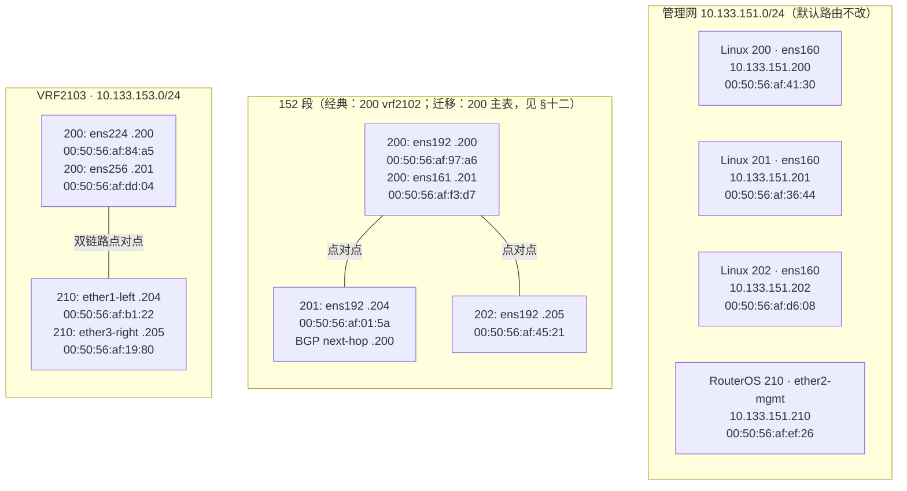

# 四台设备网络配置操作手册

> 现场形态分两种：**（A）经典** Linux 200 用 `vrf2102` 承载 152 段、`vrf2103` 承载 153 段；**（B）迁移形态（2026-05）** 152 侧 `ens192`/`ens161` 进**主表**，删除 `vrf2102`，与 Linux 201 的主 BGP 在 **FRR default**；153 仍为 `vrf2103`；多会话卫星 **`vbgp25x`** + OP ARP/BGP；详见 **§十二**。下文 §二～§六仍以 **（A）** 为主干描述，迁移时以 §十二 为准替换对应段落。
>
> 管理网 `10.133.151.0/24` 与默认路由不改。所有业务地址掩码为 `/24`。

---

## 一、登录信息

| 设备 IP | 系统 | SSH 用户 | 密码 | 角色 |
|---------|------|----------|------|------|
| 10.133.151.200 | Linux | `root` | `1234qwer` | 中心节点；**经典**：`vrf2102`+`vrf2103`；**迁移**：152 主表 + `vrf2103`（§十二） |
| 10.133.151.201 | Linux | `root` | `1234qwer` | 152 段客户端 |
| 10.133.151.202 | Linux | `root` | `1234qwer` | 152 段客户端 |
| 10.133.151.210 | MikroTik RouterOS | `admin` | `1234qwer` | 153 段 RouterOS |

```bash
ssh root@10.133.151.200
ssh root@10.133.151.201
ssh root@10.133.151.202
ssh admin@10.133.151.210
```

---

## 二、当前接口、IP、MAC

| 主机 | 接口 | IP | MAC | 说明 |
|------|------|----|-----|------|
| 200 | `ens160` | 10.133.151.200/24 | `00:50:56:af:41:30` | 管理口，默认路由经 `10.133.151.254` |
| 200 | `ens192` | 10.133.152.200/24 | `00:50:56:af:97:a6` | **经典**：`vrf2102`，连 201；**迁移**：主表（§十二） |
| 200 | `ens161` | 10.133.152.201/24 | `00:50:56:af:f3:d7` | **经典**：`vrf2102`，连 202；**迁移**：主表（§十二） |
| 200 | `ens224` | 10.133.153.200/24 | `00:50:56:af:84:a5` | `vrf2103`，连接 ROS `.204` |
| 200 | `ens256` | 10.133.153.201/24 | `00:50:56:af:dd:04` | `vrf2103`，连接 ROS `.205` |
| 200 | `vrftrans2102` / `vrftrans2103` | 10.255.210.1/30、10.255.210.2/30 | 动态 veth MAC | 200 内部跨 VRF 转发链路 |
| 201 | `ens160` | 10.133.151.201/24 | `00:50:56:af:36:44` | 管理口 |
| 201 | `ens192` | 10.133.152.204/24 | `00:50:56:af:01:5a` | 当前在主表；`10.133.153.0/24` 等由 BGP 学到，下一跳 `10.133.152.200`（公网可走 `default-originate` 或 201 侧策略路由） |
| 202 | `ens160` | 10.133.151.202/24 | `00:50:56:af:d6:08` | 管理口 |
| 202 | `ens192` | 10.133.152.205/24 | `00:50:56:af:45:21` | 当前在主表，到 153 段经 `10.133.152.201` |
| ROS 210 | `ether2-mgmt` | 10.133.151.210/24 | `00:50:56:af:ef:26` | 管理口，默认路由经 `10.133.151.254` |
| ROS 210 | `ether1-left` | 10.133.153.204/24 | `00:50:56:af:b1:22` | 153 物理口 |
| ROS 210 | `ether3-right` | 10.133.153.205/24 | `00:50:56:af:19:80` | 153 物理口 |

---

## 三、拓扑图



---

## 四、Linux 200 配置

```bash
modprobe vrf

ip link add vrf2103 type vrf table 2103 2>/dev/null || true
ip link add vrf2102 type vrf table 2102 2>/dev/null || true
ip link set vrf2103 up
ip link set vrf2102 up

ip link set ens224 up
ip link set ens256 up
ip link set ens192 up
ip link set ens161 up

# 清理旧 VLAN/IPIP/业务地址；管理口 ens160 不动。
ip link del ipip153 2>/dev/null || true
ip tunnel del ipip153 2>/dev/null || true
ip link del ens224.2103 2>/dev/null || true
ip link del ens256.2103 2>/dev/null || true
ip link del ens192.2102 2>/dev/null || true
ip link del ens161.2102 2>/dev/null || true
ip addr del 10.133.153.200/24 dev ens224 2>/dev/null || true
ip addr del 10.133.153.201/24 dev ens256 2>/dev/null || true
ip addr del 10.133.152.200/24 dev ens192 2>/dev/null || true
ip addr del 10.133.152.201/24 dev ens161 2>/dev/null || true

ip link set ens224 master vrf2103
ip link set ens256 master vrf2103
ip addr add 10.133.153.200/24 dev ens224
ip addr add 10.133.153.201/24 dev ens256

ip link set ens192 master vrf2102
ip link set ens161 master vrf2102
ip addr add 10.133.152.200/24 dev ens192
ip addr add 10.133.152.201/24 dev ens161

ip route replace 10.133.153.204/32 dev ens224 table 2103
ip route replace 10.133.153.205/32 dev ens256 table 2103
ip route replace 10.133.152.204/32 dev ens192 table 2102
ip route replace 10.133.152.205/32 dev ens161 table 2102
```

验证：

```bash
ip -br a
ip route show table 2102
ip route show table 2103
ip vrf exec vrf2102 ping -c 3 10.133.152.204
ip vrf exec vrf2102 ping -c 3 10.133.152.205
ip vrf exec vrf2103 ping -c 3 10.133.153.204
ip vrf exec vrf2103 ping -c 3 10.133.153.205
```

---

## 五、Linux 201 / 202 配置

当前现场 201/202 不建 `vrf2102`，业务口在主表，默认路由仍走管理口。Linux 201 到 153 段等业务前缀由 BGP 学习，不再保留手工静态业务路由。

```bash
# Linux 201
ip link set ens192 up
ip link del ens192.2102 2>/dev/null || true
ip link set ens192 nomaster 2>/dev/null || true
ip addr del 10.133.152.204/24 dev ens192 2>/dev/null || true
ip addr add 10.133.152.204/24 dev ens192
ip route del 10.133.153.0/24 via 10.133.152.200 dev ens192 2>/dev/null || true
ip rule del pref 9 2>/dev/null || true
ip rule del pref 10 2>/dev/null || true
ip route flush table 2001 2>/dev/null || true

# 可选：若要用「任意公网 IP/域名」验证且确保业务源地址经 Linux 200，
# 可对源地址 10.133.152.204 做策略默认路由（不影响管理口默认路由）。
ip rule del pref 100 2>/dev/null || true
ip rule add pref 100 from 10.133.152.204/32 table 2001
ip route replace default via 10.133.152.200 dev ens192 table 2001

# Linux 202
ip link set ens192 up
ip link del ens192.2102 2>/dev/null || true
ip link set ens192 nomaster 2>/dev/null || true
ip addr del 10.133.152.205/24 dev ens192 2>/dev/null || true
ip addr add 10.133.152.205/24 dev ens192
ip route replace 10.133.153.0/24 via 10.133.152.201 dev ens192
```

验证：

```bash
ip -br a
ip route show
ping -c 3 10.133.153.204
ping -c 3 10.133.153.205
```

---

## 六、Linux 200 / 201 内部 BGP

用途：Linux 201 不再写静态业务路由，而是通过 eBGP 从 Linux 200 学到业务前缀。管理口默认路由保持 `ens160 -> 10.133.151.254`。

| 节点 | AS | Router ID | BGP 邻居 |
|------|----|-----------|----------|
| Linux 200 `vrf2102` | 65200 | `10.133.152.200` | `10.133.152.204 AS65201` |
| Linux 200 **default**（迁移，§十二） | 65200 | `10.133.152.200` | `10.133.152.204 AS65201` |
| Linux 201 主表 | 65201 | `10.133.152.204` | `10.133.152.200 AS65200`；多会话另见 **`neighbor 10.133.152.25x`**（卫星） |

Linux 200 宣告：

- `10.133.153.0/24`

若需让 201 对**某一固定公网 IP** 走 200，可在 `address-family ipv4 unicast` 下按需增加 `network x.x.x.x/32`，并在 vrf2102 内核路由中为该 `/32` 配置经 `vrftrans2102` 的可达路径；不再在仓库文档中绑定易变的域名解析结果。

### Linux 200 FRR

```bash
apt-get install -y frr frr-pythontools
sed -i 's/^zebra=.*/zebra=yes/' /etc/frr/daemons
sed -i 's/^bgpd=.*/bgpd=yes/' /etc/frr/daemons

ip route replace vrf vrf2102 10.133.153.0/24 via 10.255.210.2 dev vrftrans2102
ip route replace vrf vrf2102 default via 10.255.210.2 dev vrftrans2102
```

`/etc/frr/frr.conf`：

```frr
frr version 7.2
frr defaults traditional
hostname linux200
log syslog informational
service integrated-vtysh-config
!
router bgp 65200 vrf vrf2102
 bgp router-id 10.133.152.200
 neighbor 10.133.152.204 remote-as 65201
 !
 address-family ipv4 unicast
  network 10.133.153.0/24
  neighbor 10.133.152.204 activate
  neighbor 10.133.152.204 next-hop-self
  neighbor 10.133.152.204 default-originate
 exit-address-family
!
router bgp 65200 vrf vrf2103
 bgp router-id 10.133.153.200
 neighbor 10.133.153.204 remote-as 65202
 !
 address-family ipv4 unicast
  network 10.133.152.0/24
  neighbor 10.133.153.204 activate
  neighbor 10.133.153.204 next-hop-self
 exit-address-family
!
line vty
!
```

```bash
systemctl enable frr
systemctl restart frr
vtysh -c 'show bgp vrf vrf2102 summary'
vtysh -c 'show bgp vrf vrf2102 ipv4 unicast'
```

### Linux 201 FRR

```bash
apt-get install -y frr frr-pythontools mtr traceroute
sed -i 's/^zebra=.*/zebra=yes/' /etc/frr/daemons
sed -i 's/^bgpd=.*/bgpd=yes/' /etc/frr/daemons
```

`/etc/frr/frr.conf`：

```frr
frr version 7.2
frr defaults traditional
hostname linux201
log syslog informational
service integrated-vtysh-config
!
router bgp 65201
 bgp router-id 10.133.152.204
 neighbor 10.133.152.200 remote-as 65200
 !
 address-family ipv4 unicast
  neighbor 10.133.152.200 activate
 exit-address-family
!
line vty
!
```

```bash
systemctl enable frr
systemctl restart frr

# 确认由 BGP 装表，下一跳仍是 Linux 200。
vtysh -c 'show bgp summary'
vtysh -c 'show ip route bgp'
ip route show | egrep '10.133.153|default|10.133.152'
ip route get 1.1.1.1
```

当前验证结果：

```text
B>* 0.0.0.0/0 [20/0] via 10.133.152.200, ens192
B>* 10.133.153.0/24 [20/0] via 10.133.152.200, ens192
```

---

## 七、RouterOS 210 配置

```routeros
/interface ipip remove [find name=ipip153]
/ip address remove [find interface=ipip153]
/ip address remove [find interface=vlan2103-e1]
/ip address remove [find interface=vlan2103-e3]
/interface vlan remove [find name=vlan2103-e1]
/interface vlan remove [find name=vlan2103-e3]

/ip address remove [find address~"10.133.153" interface=ether1-left]
/ip address remove [find address~"10.133.153" interface=ether3-right]
/ip address add address=10.133.153.204/24 interface=ether1-left
/ip address add address=10.133.153.205/24 interface=ether3-right

/ip route remove [find comment="cross-vrf-transit"]
/ip route add dst-address=10.133.152.204/32 gateway=10.133.153.200 comment="cross-vrf-transit"
/ip route add dst-address=10.133.152.205/32 gateway=10.133.153.201 comment="cross-vrf-transit"
```

验证：

```routeros
/interface print detail
/ip address print
/ip route print
/ping count=3 10.133.153.200
/ping count=3 10.133.153.201
/ping count=3 10.133.152.204
/ping count=3 10.133.152.205
```

---

## 八、跨 VRF 转发（Linux 200）

```bash
sysctl -w net.ipv4.ip_forward=1
for i in all default ens192 ens161 ens224 ens256; do sysctl -w net.ipv4.conf.${i}.rp_filter=2 2>/dev/null || true; done

ip link del vrftrans2102 2>/dev/null || true
ip link add vrftrans2102 type veth peer name vrftrans2103
ip link set vrftrans2102 master vrf2102
ip link set vrftrans2103 master vrf2103
ip addr add 10.255.210.1/30 dev vrftrans2102
ip addr add 10.255.210.2/30 dev vrftrans2103
ip link set vrftrans2102 up
ip link set vrftrans2103 up

ip route replace vrf vrf2102 10.133.153.204/32 via 10.255.210.2 dev vrftrans2102
ip route replace vrf vrf2102 10.133.153.205/32 via 10.255.210.2 dev vrftrans2102
ip route replace vrf vrf2102 10.133.153.0/24 via 10.255.210.2 dev vrftrans2102
ip route replace vrf vrf2103 10.133.152.204/32 via 10.255.210.1 dev vrftrans2103
ip route replace vrf vrf2103 10.133.152.205/32 via 10.255.210.1 dev vrftrans2103
```

---

## 九、BGP 上联（RouterOS 210）

### 9.1 与 Linux 200 vrf2103 建立 eBGP

本端 AS：`65202`  
远端 peer：`10.133.153.200`（Linux 200 vrf2103）  
远端 AS：`65200`

```routeros
/routing bgp instance set [find name=default] as=65202 router-id=10.133.153.204
/routing bgp peer remove [find remote-address=10.133.153.200]
/routing bgp peer add name=peer-linux200-vrf2103 remote-address=10.133.153.200 remote-as=65200 update-source=10.133.153.204 hold-time=3m
```

### 9.2 公网上联 BGP

本端 AS：`100`（需与上联 ISP 协商）  
远端 peer：`139.159.30.17`  
远端 AS：`131320`

> 注意：若同时需要上联公网 BGP，需使用 BGP vrf 或 separate instance。当前现场优先配置与 Linux 200 的内部 BGP。

```routeros
/routing bgp instance set [find name=default] as=100 router-id=10.133.151.210
/routing bgp peer remove [find remote-address=139.159.30.17]
/routing bgp peer add name=peer-as131320 remote-address=139.159.30.17 remote-as=131320 multihop=yes update-source=10.133.151.210 hold-time=3m
```

验证：

```routeros
/routing bgp instance print detail
/routing bgp peer print detail
/log print where topics~"bgp"
/ip route print where bgp=yes
```

### 9.3 Linux 200 验证命令

```bash
# 查看 vrf2103 的 BGP 邻居状态
vtysh -c 'show bgp vrf vrf2103 summary'

# 查看 BGP 路由表
vtysh -c 'show bgp vrf vrf2103 ipv4 unicast'

# 查看内核路由表
ip route show table 2103

# 验证连通性
ip vrf exec vrf2103 ping -c 3 10.133.153.204
```

> 当前已配置邻居，但此前检查未出现 `E`（Established）。若仍未建立，请让远端按 `neighbor 10.133.151.210 remote-as 100`、多跳、源地址和 MD5 配置保持一致。

---

## 十、ICMP MTR 拦截与按跳替换

用途：Linux 200 上通过 nftables + NFQUEUE + OP 规则对 ICMP Echo（ping/mtr 探测）做按跳替换。Linux 201 在业务源地址上经 BGP/`default-originate` 或策略路由把探测流量送到 `10.133.152.200` 时，才会进入本机劫持链。

```bash
# Linux 200
sudo add-apt-repository universe
sudo apt install python3-scapy python3-netfilterqueue nftables python3-dev gcc libnetfilter-queue-dev

# OP / uvicorn 已部署在 /root/mtr_op；日常更新见仓库根目录 deploy.md（python tools/deploy_light_200.py）；全量安装见 service/scripts/deploy_linux200.py。
curl -sS -X PUT http://127.0.0.1:8808/api/global \
  -H 'Content-Type: application/json' -d '{"hijack_enabled":true}'

# 当前验证方式：本机在 vrf2103 探测真实公网路径，前缀补上 201->200 与 veth 两跳。
pkill -f /root/mtr_op/mtr_spoof_nfqueue.py 2>/dev/null || true
nohup python3 /root/mtr_op/mtr_spoof_nfqueue.py \
  --op-db /root/mtr_op/data.db \
  --probe-local-vrf-exec 'ip vrf exec vrf2103' \
  --prefix-hop-ips '10.133.152.200,10.255.210.2' \
  --probe-mtr-count 3 \
  --probe-mtr-extra '-4 -m 32' \
  --probe-min-hops 2 \
  --probe-timeout 90 \
  --verbose >> /tmp/mtr_spoof_nfqueue.log 2>&1 &
```

当前 OP 逐跳替换规则：

| 匹配真实 hop | 伪造显示 IP | 延迟配置 | 说明 |
|--------------|-------------|----------|------|
| `10.133.153.204/32` / `10.133.153.205/32` | `200.100.0.3` | 20-50 ms | MTR 第 3 跳伪造 |
| `10.133.151.254/32` | `200.100.0.4` | 30-70 ms | MTR 第 4 跳伪造 |

验证（Linux 201）：

```bash
ip route get 1.1.1.1 from 10.133.152.204
vtysh -c 'show ip route bgp'
mtr -r -n -c 3 -i 1 -a 10.133.152.204 -I ens192 1.1.1.1

# Linux 200
nft list chain inet mtr_spoof prerouting
pgrep -af mtr_spoof_nfqueue
grep -E 'TE ttl=[1-4] ' /tmp/mtr_spoof_nfqueue.log | tail -n 20
```

当前验证输出摘要：

```text
201 路由（示例，随现场 BGP 略有不同）：
B>* 0.0.0.0/0 [20/0] via 10.133.152.200, ens192
B>* 10.133.153.0/24 [20/0] via 10.133.152.200, ens192

MTR（目的 1.1.1.1，源 10.133.152.204）：
1  10.133.152.200
2  10.255.210.2
3  200.100.0.3       Avg 约 75ms
4  200.100.0.4       Avg 约 129ms
...
末跳 1.1.1.1         Avg 约 RTT 到公网目标
```

---

## 十一、回滚

```bash
# Linux 200
systemctl stop frr 2>/dev/null || true
pkill -f /root/mtr_op/mtr_spoof_nfqueue.py 2>/dev/null || true
ip link del vrftrans2102 2>/dev/null || true
ip link del ens224.2103 2>/dev/null || true
ip link del ens256.2103 2>/dev/null || true
ip link del ens192.2102 2>/dev/null || true
ip link del ens161.2102 2>/dev/null || true
ip link del ipip153 2>/dev/null || true
ip tunnel del ipip153 2>/dev/null || true
ip addr del 10.133.153.200/24 dev ens224 2>/dev/null || true
ip addr del 10.133.153.201/24 dev ens256 2>/dev/null || true
ip addr del 10.133.152.200/24 dev ens192 2>/dev/null || true
ip addr del 10.133.152.201/24 dev ens161 2>/dev/null || true
ip link set ens224 nomaster 2>/dev/null || true
ip link set ens256 nomaster 2>/dev/null || true
ip link set ens192 nomaster 2>/dev/null || true
ip link set ens161 nomaster 2>/dev/null || true
ip link del vrf2103 2>/dev/null || true
ip link del vrf2102 2>/dev/null || true

# Linux 201
systemctl stop frr 2>/dev/null || true
ip addr del 10.133.152.204/24 dev ens192 2>/dev/null || true

# Linux 202
ip route del 10.133.153.0/24 via 10.133.152.201 dev ens192 2>/dev/null || true
ip addr del 10.133.152.205/24 dev ens192 2>/dev/null || true
```

```routeros
# RouterOS 210
/ip route remove [find comment="cross-vrf-transit"]
/ip address remove [find address~"10.133.153" interface=ether1-left]
/ip address remove [find address~"10.133.153" interface=ether3-right]
/routing bgp peer remove [find name=peer-as131320]
```

---

## 十二、Linux 200 迁移形态：152 进主表 + 卫星 vbgp + OP

**适用**：希望 **去掉 `vrf2102`**，152 物理口与 **FRR 主会话（对 Linux 201）** 落在 **default 主表**；**保留 `vrf2103`** 与 ROS 侧 BGP；**保留** 卫星 VRF **`vbgp25x`** 与 OP 的 ARP 引流 / BGP 管理（多会话）。

### 12.1 与经典形态的差异

| 项目 | 经典（§二～§六） | 迁移形态（本节） |
|------|------------------|------------------|
| `ens192` / `ens161` | `master vrf2102` | **`ip link set … nomaster`**，地址仍在接口上，走**主表** |
| `vrf2102` | 存在，table 2102 | **删除**（无 slave 后 `ip link del vrf2102`） |
| `vrftrans2102` | `master vrf2102` | **`nomaster`**，地址 `10.255.210.1/30`，主表经对端访问 153 |
| 主 BGP（对 201 `.204`） | `router bgp 65200 vrf vrf2102` | **`router bgp 65200`**（default），`neighbor 10.133.152.204` |
| 卫星 BGP | `MTR_SATELLITE_PHY_VRF=vrf2102` | **`MTR_SATELLITE_PHY_VRF=default`**（或 `main` / 空），veth 对端 **`nomaster`** |
| 代码 | — | `service/app/satellite_vrf_assign.py` 不再写死 **`table 2102`**；phy 为主表时用 **`ip route replace …/32`** |

### 12.2 systemd（mtr-op）推荐环境变量

仓库：`service/systemd/mtr-op.service` 及 drop-in 示例。

| 变量 | 迁移形态建议值 | 说明 |
|------|----------------|------|
| `MTR_SATELLITE_PHY_VRF` | `default` | 卫星 veth 挂主表 |
| `MTR_AUTO_SATELLITE_VRF` | `note` | 仅 `note` 含关键字的 ARP 条目才自动建卫星，避免对 `.200` 误建 `vbgp200` |
| `MTR_AUTO_SATELLITE_VRF_NOTE` | `BGPSAT` | 与 OP 里卫星条目的 `note` 一致 |
| `MTR_SATELLITE_PEER_IP` | `10.133.152.204` | 卫星 VRF 内到 201 的 host 路由目标 |
| `MTR_SATELLITE_BGP_TCP_SOURCE` | **`spoof`** | 若 Linux 201 仍为 **`neighbor 10.133.152.25x`**，须配合 **§12.3 nft SNAT**；若改为 **`neighbor 10.255.x.1`**（veth 本端），可改为 **`underlay`** 且不必 nft |

### 12.3 BGP TCP/179 SNAT（`spoof` + 201 邻居 `.25x` 时必做）

当 **201 上 `neighbor 10.133.152.250`** 而 FRR 在卫星 VRF 内实际以 **underlay 源 `10.255.211.1`** 访问 `.204:179` 时，须在 **Linux 200** 上加载 **nft `inet nat_sat_bgp`**，把 **`10.255.211.1 → 10.133.152.204:179`** 的报文 **SNAT 为 `10.133.152.250`**，使对端 TCP 与 BGP OPEN 一致。

```bash
# 仓库脚本（也可由 migrate 脚本自动上传执行）
bash scripts/ensure_nat_sat_bgp_linux200.sh
nft list table inet nat_sat_bgp
```

脚本自动识别 **`vbgp250a`** 或 **`vbg250a`** 命名。部署后建议 **`vtysh`** 对卫星邻居 **`shutdown` / `no shutdown`** 或执行 `python scripts/deploy_nat_sat_and_op_main.py`（含上传 `main.py`、nft、抖邻居、重启 mtr-op）。

### 12.4 一键迁移与 OP 验收

```bash
pip install paramiko
python scripts/migrate_linux200_152_main_default.py
```

脚本要点：备份 FRR、`nomaster`、主表到 153 的静态、`no router bgp 65200 vrf vrf2102`、上传 **`satellite_vrf_assign.py`** / **`main.py`**、写 systemd drop-in、OP 打开 ARP、添加 **`10.133.152.200`**（无 `BGPSAT`）与 **`10.133.152.250`**（`note=BGPSAT`，`satellite_vrf=vbgp250`）、`POST …/satellite-vrfs/reconcile`、nft、**POST** default 与 `vbgp250` 的 BGP 邻居、补 **`network 10.133.153.0/24`** / **`default-originate`**（default 实例）。

### 12.5 OP 与 `main.py` 行为说明

- **`main.py`**：当 **`MTR_SATELLITE_BGP_TCP_SOURCE=spoof`** 且 **`MTR_SATELLITE_PHY_VRF` 为主表** 时，启动会打 **warning**，提示配置 **nft** 或改为 **underlay + 201 邻居改为 veth 地址**。
- **卫星未建成功**：多为 **`MTR_AUTO_SATELLITE_VRF`** 未开或 ARP 总开关关、或 `note` 不匹配；**不是**单独改 OP「业务逻辑」即可绕过内核/nft 约束。

### 12.6 验证命令摘要

```bash
# Linux 200
ip route | grep -E '152\\.250|255\\.211|153\\.'
vtysh -c 'show bgp ipv4 unicast summary'
vtysh -c 'show bgp vrf vbgp250 ipv4 unicast summary'
curl -sS http://127.0.0.1:8808/api/arp-spoof/targets
curl -sS 'http://127.0.0.1:8808/api/bgp/neighbors?vrf=vbgp250'
ss -tnp state established '( dport = :179 or sport = :179 )'

# Linux 201
vtysh -c 'show bgp ipv4 unicast summary'
```

---

## 十三、复制到另一套环境

替换另一套环境时只需要同步修改：

| 类型 | 当前现场示例 |
|------|--------------|
| 管理地址 | `10.133.151.200/201/202/210` |
| 152 / 153 地址 | `10.133.152.*`、`10.133.153.*` |
| Linux 200 接口 | `ens160`、`ens192`、`ens161`、`ens224`、`ens256` |
| Linux 201/202 接口 | `ens160`、`ens192` |
| RouterOS 接口 | `ether2-mgmt`、`ether1-left`、`ether3-right` |
| 内部 BGP | Linux 200 AS `65200`，Linux 201 AS `65201`，邻居跑在 152 段 |
| RouterOS 上联 BGP | 本端 AS `100`，远端 `139.159.30.17 AS131320` |

---

*文档说明：本文件保留当前现场可执行配置、验证、BGP、MTR 与回滚步骤；**§十二** 为 Linux 200「152 进主表 + 卫星 + OP」迁移形态。历史排查、VLAN/IPIP 备选和旧版兼容说明已删除。*
